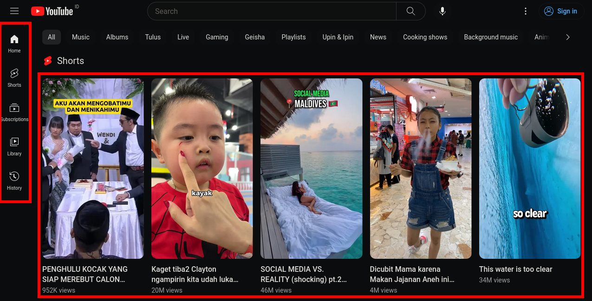
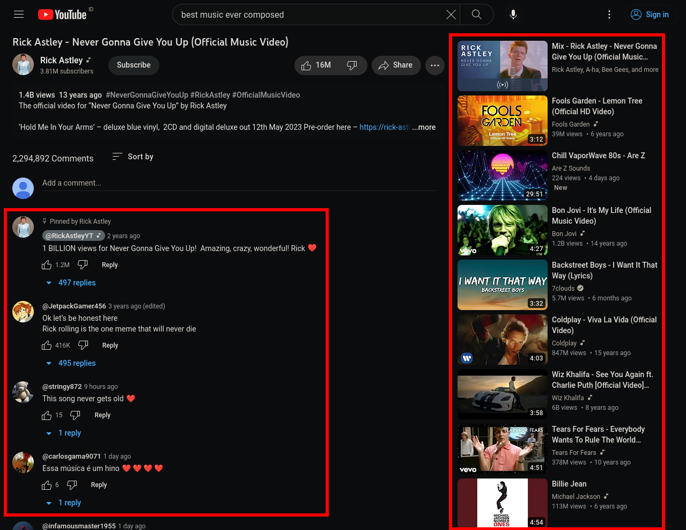
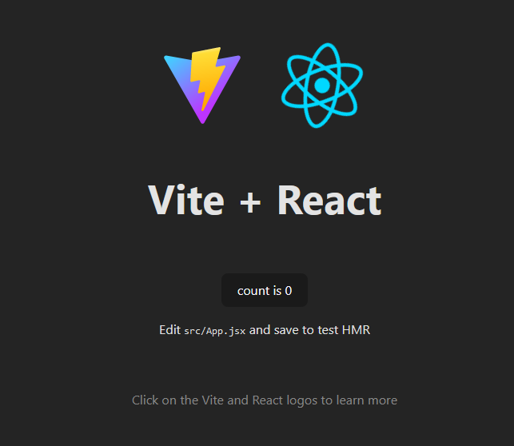
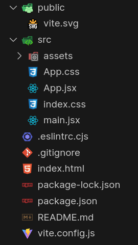

## Pengantar React JS

---

### Apa itu React Js?

- Library javascript untuk _front-end_ (dijalankan di client)
- Dibuat oleh Facebook (Meta)
- Mempermudah pembuatan "komponen" yang:
  - dapat digunakan ulang (reuseable)
  - menampilkan data yang berubah ubah

---

### Contoh Component Reusable


---

### Contoh Component Reusable



---

### Contoh Component Reusable



---

### Membuat project React baru menggunakan Vite

```sh
npm create vite@latest <nama-project> -- --template=react
```

Perhatikan bahwa ada "--" kosong setelah nama project

---

### Membuat project React baru menggunakan Vite

```sh
npm create vite@latest first-react-app -- --template=react
cd first-react-app
npm install
npm run dev
```

---

### Hasil



---

### Struktur Project

Di sini File yang penting adalah `main.jsx` dan `App.jsx`



---

### main.jsx

```jsx
import React from "react";
import ReactDOM from "react-dom/client";
import App from "./App.jsx";
import "./index.css";

ReactDOM.createRoot(document.getElementById("root")).render(
  <React.StrictMode>
    <App />
  </React.StrictMode>
);
```

---

### App.jsx

```jsx
import { useState } from "react";
import reactLogo from "./assets/react.svg";
import viteLogo from "/vite.svg";
import "./App.css";

function App() {
  const [count, setCount] = useState(0);

  return (
    <>
      <div>
        <a href="https://vitejs.dev" target="_blank">
          
        </a>
        <a href="https://react.dev" target="_blank">
          
        </a>
      </div>
      <h1>Vite + React</h1>
      <div className="card">
        <button onClick={() => setCount((count) => count + 1)}>
          count is {count}
        </button>
        <p>
          Edit <code>src/App.jsx</code> and save to test HMR
        </p>
      </div>
      <p className="read-the-docs">
        Click on the Vite and React logos to learn more
      </p>
    </>
  );
}

export default App;
```

---

### Cara kerja React JS dan JSX

- Pada slide sebelumnya terlihat penggunaan syntax javascript yang tidak biasa (ada campuran antara javascript dan tag yang mirip dengan XML). Syntax ini disebut JSX
- React JS adalah library front-end, sehingga seharusnya code harus bisa dijalankan oleh web browser
- Code yang bisa dijalankan web browser hanya file HTML, CSS, dan JavaScript.

---

### React JS tanpa JSX

Berikut adalah contoh code React JS yang dapat dijalankan pada browser

---

```html
<!DOCTYPE html>
<html>
  <head>
    <meta charset="UTF-8" />
    <title>Hello World</title>
    <script src="https://unpkg.com/react@18/umd/react.development.js"></script>
    <script src="https://unpkg.com/react-dom@18/umd/react-dom.development.js"></script>
  </head>
  <body>
    <div id="root"></div>
    <script>
      function Hello({ toWhat }) {
        return React.createElement("div", null, `Hello ${toWhat}`);
      }
      const root = ReactDOM.createRoot(document.getElementById("root"));
      root.render(React.createElement(Hello, { toWhat: "World" }, null));
    </script>
  </body>
</html>
```

---

```html
<!DOCTYPE html>
<html>
  <head>
    <!-- ... -->
    <script src="https://unpkg.com/react@18/umd/react.development.js"></script>
    <script src="https://unpkg.com/react-dom@18/umd/react-dom.development.js"></script>
  </head>
  <body>
    <!-- ... -->
  </body>
</html>
```

---

```html
<!DOCTYPE html>
<html>
  <!-- ... -->
  <body>
    <div id="root"></div>
    <script>
      function Hello({ toWhat }) {
        return React.createElement("div", null, `Hello ${toWhat}`);
      }
      const root = ReactDOM.createRoot(document.getElementById("root"));
      root.render(React.createElement(Hello, { toWhat: "World" }, null));
    </script>
  </body>
</html>
```

---

Bisa dilihat bahwa penulisan code membuat component (`React.createElement`) sangatlah merepotkan.

```html
<script>
  function Hello({ toWhat }) {
    return React.createElement("div", null, `Hello ${toWhat}`);
  }
  const root = ReactDOM.createRoot(document.getElementById("root"));
  root.render(React.createElement(Hello, { toWhat: "World" }, null));
</script>
```

Oleh sebab itu Facebook menciptakan JSX

---

### JSX

- Extension dari JavaScript
- Harus melewati proses "transpiling" menuju javascript agar dapat dijalankan oleh browser

---

### React JS dengan JSX

```html
<!DOCTYPE html>
<html>
  <head>
    <meta charset="UTF-8" />
    <title>Hello World</title>
    <script src="https://unpkg.com/react@18/umd/react.development.js"></script>
    <script src="https://unpkg.com/react-dom@18/umd/react-dom.development.js"></script>
    <script src="https://unpkg.com/@babel/standalone/babel.min.js"></script>
  </head>
  <body>
    <div id="root"></div>
    <script type="text/babel">
      function MyApp() {
        return <h1>Hello, world!</h1>;
      }
      const container = document.getElementById("root");
      const root = ReactDOM.createRoot(container);
      root.render(<MyApp />);
    </script>
  </body>
</html>
```

---

### React JS dengan JSX

```html
<!DOCTYPE html>
<html>
  <head>
    <!-- ... -->
    <script src="https://unpkg.com/@babel/standalone/babel.min.js"></script>
  </head>
  <!-- ... -->
</html>
```

---

### React JS dengan JSX

```html
<!DOCTYPE html>
<html>
  <!-- ... -->
  <body>
    <!-- ... -->
    <script type="text/babel">
      //...
    </script>
  </body>
</html>
```

---

### React JS dengan JSX

```html
<!DOCTYPE html>
<html>
  <!-- ... -->
  <body>
    <div id="root"></div>
    <script type="text/babel">
      function MyApp() {
        return <h1>Hello, world!</h1>;
      }
      //...
      root.render(<MyApp />);
    </script>
  </body>
</html>
```

---

### Babel JS

- Salah satu library yang bisa melakukan proses transpiling
- [https://babeljs.io/repl](https://babeljs.io/repl) untuk mencoba langsung
- Dimanfaatkan untuk:
  - Mengubah JSX ke JS
  - Downgrade versi JavaScript agar code kita masih tetap bisa berjalan di browser lama

---

### Demo Babel JS

Coba transpile code berikut. Pertama-tama targetnya Node versi 10.13, kemudian coba Node versi 1.0

```jsx
function Hello({ toWhat }) {
  return <div>Hello {toWhat}</div>;
}
const container = document.getElementById("root");
const root = ReactDOM.createRoot(container);
root.render(<Hello toWhat="world" />);
```

---

### Target Node 10.13

```js
import { jsxs as _jsxs } from "react/jsx-runtime";
import { jsx as _jsx } from "react/jsx-runtime";
function Hello({ toWhat }) {
  return /*#__PURE__*/ _jsxs("div", {
    children: ["Hello ", toWhat],
  });
}
const container = document.getElementById("root");
const root = ReactDOM.createRoot(container);
root.render(
  /*#__PURE__*/ _jsx(Hello, {
    toWhat: "world",
  })
);
```

---

### Target Node 1.0

```js
import { jsxs as _jsxs } from "react/jsx-runtime";
import { jsx as _jsx } from "react/jsx-runtime";
function Hello(_ref) {
  var toWhat = _ref.toWhat;
  return /*#__PURE__*/ _jsxs("div", {
    children: ["Hello ", toWhat],
  });
}
var container = document.getElementById("root");
var root = ReactDOM.createRoot(container);
root.render(
  /*#__PURE__*/ _jsx(Hello, {
    toWhat: "world",
  })
);
```

---

### Target Node 1.0

```js
//...
function Hello(_ref) {
  var toWhat = _ref.toWhat;
  return /*#__PURE__*/ _jsxs("div", {
    children: ["Hello ", toWhat],
  });
}
//...
```

---

### Kembali ke sini


---

### Vite Build

Vite menyediakan fitur untuk melakukan "bundling" sehingga aplikasi javascript yang kita buat akan menjadi 1 file html, 1 file js, 1 file css, dan asset seperti gambar yang diperlukan. Cukup jalankan perintah berikut:

```sh
npx vite build
```

Kemudian cek folder `dist`

---

### Coding

---

### Import CSS dan gambar (dari App.jsx)

```jsx
import { useState } from "react";
import reactLogo from "./assets/react.svg";
import viteLogo from "/vite.svg";
import "./App.css";

function App() {
  const [count, setCount] = useState(0);

  return (
    <>
      <div>
        <a href="https://vitejs.dev" target="_blank">
          
        </a>
        <a href="https://react.dev" target="_blank">
          
        </a>
      </div>
      <h1>Vite + React</h1>
      <div className="card">
        <button onClick={() => setCount((count) => count + 1)}>
          count is {count}
        </button>
        <p>
          Edit <code>src/App.jsx</code> and save to test HMR
        </p>
      </div>
      <p className="read-the-docs">
        Click on the Vite and React logos to learn more
      </p>
    </>
  );
}

export default App;
```

---

### Import CSS

```jsx
//...
import "./App.css";
//...
```

---

### Import gambar

```jsx
import reactLogo from "./assets/react.svg";
import viteLogo from "/vite.svg";
function App() {
  return (
    <div>
      <a href="https://vitejs.dev" target="_blank">
        
      </a>
      <a href="https://react.dev" target="_blank">
        
      </a>
    </div>
  );
}

export default App;
```

---

### Membuat functional component

```jsx
function Hello() {
  return <h1>Hello World!</h1>;
}
function Hello2() {
  const who = "dunia";
  return <h1>Hello {who}!</h1>;
}
//Illegal, component harus pure
function HelloRandom() {
  const who = Math.random().toString(36);
  return <h1>Hello {who}!</h1>;
}
```

---

### Composite Component

```jsx
function Hello() {
  return <h1>Hello World!</h1>;
}
function Hello2() {
  const who = "dunia";
  return <h1>Hello {who}!</h1>;
}

function App() {
  return (
    <>
      <Hello />
      <Hello2 />
    </>
  );
}
```

---

### Properties dan children

```jsx
function PropsComponent(props) {
  console.log(props);
  const { prop1, prop2 } = props;
  return (
    <table>
      <tbody>
        <tr>
          <td>prop1</td>
          <td>:</td>
          <td>{prop1}</td>
        </tr>
        <tr>
          <td>prop2</td>
          <td>:</td>
          <td>{prop2}</td>
        </tr>
      </tbody>
    </table>
  );
}
function Paragraph(props) {
  console.log(props.children);
  return <p>{props.children}</p>;
}
//...
}
```

---

### Properties dan children

```jsx
//...
function App() {
  return (
    <>
      <PropsComponent prop1="a" prop2="b" />
      <Paragraph>
        halo halo <span>wkwkwk</span> halo halo
      </Paragraph>
    </>
  );
}
```

---

### Styling component

Gunakan property style atau buat class di CSS lalu tambahkan class nya ke komponen. Properti style harus diisi dengan object, sehingga di jsx kurung kurawalnya double.

```jsx
function ElementStyle({ children }) {
  return (
    <p style={{ color: "red", fontSize: "24pt" }} className="logo">
      {children}
    </p>
  );
}
```

---

### Conditional component

```jsx
function ConditionalComponent({ condition }) {
  let x = "";
  if (condition === "true") {
    x = <h3>TRUE</h3>;
  } else {
    x = <h3>FALSE</h3>;
  }
  return <div>{x}</div>;
}

function App() {
  return <ConditionalComponent condition="true" />;
}
```

---

### List Element

```jsx
function ListItem() {
  const products = [
    { name: "a", id: 1 },
    { name: "b", id: 2 },
    { name: "c", id: 3 },
  ];
  const items = [];
  for (let i = 0; i < products.length; i++) {
    items.push(<li key={products[i].id}>{products[i].name}</li>);
  }
  return <ol>{items}</ol>;
}
function ListHello({ n }) {
  const items = [];
  for (let i = 0; i < n; i++) {
    items.push(<Hello key={i}></Hello>);
  }
  return <ul>{items}</ul>;
}

function App() {
  return (
    <>
      <ListItem />
      <ListHello n={5} />
    </>
  );
}
```

---

### Latihan

- [Halaman login](https://getbootstrap.com/docs/5.0/examples/sign-in)
- [Halaman fitur](https://getbootstrap.com/docs/5.0/examples/features)
