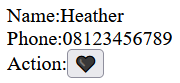
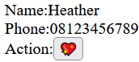
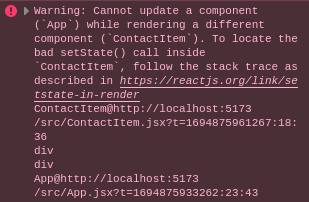

# Event Handling, State, dan Form Handling

---

## Event Handling

---

### Event handling HTML

Contoh event handling di HTML:

```html
<button
  onclick="alert('alert');console.log('click');"
  onmouseenter="console.log('hover')"
>
  Contoh event
</button>
```

Bisa dicoba di `index.html`

---

### Event handling di React

- camelCase: `onclick` -> `onClick`
- attribute diisi dengan function, bukan diisi dengan script yang ingin dijalankan

---

### Event handling di React

`EventDemo.jsx`:

```jsx
function hello() {
  alert("Hello World!");
  console.log("Hello World!");
}
export default function EventDemo() {
  return (
    <button onClick={hello} onMouseEnter={() => console.log("boop")}>
      Event Demo
    </button>
  );
}
```

---

### Event handling di React

`App.jsx`:

```jsx
import EventDemo from "./EventDemo";
export default function App() {
  return <EventDemo></EventDemo>;
}
```

---

## State

---

### Update informasi

Misalkan code `EventDemo` diubah menjadi seperti ini:

```jsx
let a = 1;
export default function EventDemo() {
  return <button onMouseEnter={() => console.log(++a)}>Event Demo {a}</button>;
}
```

Nilai `a` akan selalu bertambah tetapi teks pada button tidak berubah

---

### State

- Untuk membuat agar component dirender ulang ketika ada perubahan data, gunakan state
- Cara membuat state:
  ```jsx
  const [counter, setCounter] = useState(0);
  ```

---

### State

```jsx
const [counter, setCounter] = useState(0);
```

- Function `useState` menerima 1 parameter berupa nilai awal state (initial state)
- Return value `useState` adalah sebuah array yang berisi 2 elemen:
  - variabel untuk mendapatkan isi state saat ini
  - function untuk mengubah isi state

---

### Update informasi dengan state

```jsx
import { useState } from "react";
export default function EventDemo() {
  const [counter, setCounter] = useState(0);
  return (
    <button onMouseEnter={() => setCounter(counter + 1)}>
      Event Demo {counter}
    </button>
  );
}
```

---

### Aturan penggunaan state

- useState adalah salah satu "React Hook". Kalau ada function yang diawali dengan "use" biasanya merupakan "hook".
- [Aturan penggunaan "React Hooks"](https://legacy.reactjs.org/docs/hooks-rules.html):
  - Hanya boleh dideklarasikan di awal, tidak boleh di dalam conditional atau loop
  - Hanya boleh dipanggil di dalam functional component atau custom hooks
- untuk mengubah isi state gunakan function yang dikembalikan dari pemanggilan `useState`

---

### Aturan penggunaan state

- State harus bersifat immutable. Nilainya tidak boleh diupdate tetapi set state harus memberi nilai yang baru. **JADI, KALAU STATE BERUPA ARRAY ATAU OBJECT DAN ELEMEN MAU DITAMBAH ATAU SALAH SATU ATTRIBUTE HENDAK DIUPDATE, SET STATE HARUS DIISI DENGAN CLONE DARI ARRAY / OBJECT TERSEBUT**

---

#### Immutable State (object)

```jsx
const [mhs, setMhs] = useState({ nrp: "123", nama: "Lorem" });

//DILARANG KERAS MELAKUKAN HAL INI:
mhs.nama = "Ipsum";

//yang benar begini:
setMhs({ nrp: mhs.nrp, nama: "Ipsum" });

//syntax alternatif, biasa digunakan kalau banyak attribute yang tidak berubah:
setMhs({ ...mhs, nama: "Ipsum" });
```

---

#### Immutable State (array)

```jsx
const [mhs, setMhs] = useState(["Adelia", "Brigitte", "Callista"]);

//DILARANG KERAS MELAKUKAN HAL INI:
mhs.push("Delilah");

//yang benar begini:
let temp = mhs.slice();
temp.push("Delilah");
setMhs(temp);

//syntax alternatif:
setMhs([...mhs, "Delilah"]);
```

---

#### Immutable State (Kasus Ekstrim)

```jsx
const [mhs, setMhs] = useState({
  nrp: "123",
  nama: "Lorem",
  mkLulus: ["ITP", "PBO", "DB"],
});

// Menambah mkLulus
setMhs({
  ...mhs,
  mkLulus: [...mhs.mkLulus, "FPW"],
});
```

Kalau state sudah terlalu kompleks biasanya digunakan reducer atau menggunakan library [Immer](https://github.com/immerjs/use-immer)

---

### Aturan penggunaan state

- `setState` tidak langsung mengubah isi state
  ```jsx
  import { useState } from "react";
  export default function EventDemo() {
    const [counter, setCounter] = useState(0);
    return (
      <button
        onMouseEnter={() => {
          setCounter(counter + 1);
          setCounter(counter + 1);
          setCounter(counter + 1);
        }}
      >
        Event Demo {counter}
      </button>
    );
  }
  ```

---

### Penggunaan State

- State dinamai "state" karena React didesain seperti "state machine"
- State menyimpan keadaan ("state") saat ini, kemudian Functional Component akan menentukan apa yang ditampilkan dan bagaimana cara menampilkannya.

---

#### Contoh Penggunaan State

1. Buat komponen kontak dengan fitur favorite. Tombol favorite sifatnya toggle

 ➡ 

---

#### Contoh Penggunaan State

```jsx
import { useState } from "react";

export default function Contact() {
  const [favorite, setFavorite] = useState(false);
  return (
    <div>
      Name:Heather
      <br />
      Phone:08123456789
      <br />
      Action:
      <button onClick={() => setFavorite(!favorite)}>
        {favorite ? "💖" : "🖤"}
      </button>
    </div>
  );
}
```

---

#### Contoh Penggunaan State

2. Tambah fitur untuk delete. Apabila delete ditekan, komponen hilang (`display:none`)

```jsx
export default function Contact() {
  const [favorite, setFavorite] = useState(false);
  const [deleted, setDeleted] = useState(false);
  return (
    <div style={{ display: deleted ? "none" : "block" }}>
      {/* ... */}
      <button onClick={() => setFavorite(!favorite)}>
        {favorite ? "💖" : "🖤"}
      </button>
      <button onClick={() => setDeleted(true)}>🚮</button>
    </div>
  );
}
```

---

#### Contoh Penggunaan State

3. Tambah fitur supaya kontak favorite tidak bisa didelete (tombol delete hilang kalau kontak favorite)

---

#### Contoh Penggunaan State

```jsx
//versi 1
export default function Contact() {
  const [favorite, setFavorite] = useState(false);
  const [deleted, setDeleted] = useState(false);
  return (
    <div style={{ display: deleted ? "none" : "block" }}>
      Name:Heather
      <br />
      Phone:08123456789
      <br />
      Action:
      <button onClick={() => setFavorite(!favorite)}>
        {favorite ? "💖" : "🖤"}
      </button>
      <button
        style={{ display: favorite ? "none" : "inline" }}
        onClick={() => setDeleted(true)}
      >
        🚮
      </button>
    </div>
  );
}
```

---

#### Contoh Penggunaan State

```jsx
//versi 2
export default function Contact() {
  const [state, setState] = useState("default");
  return (
    <div style={{ display: state === "deleted" ? "none" : "block" }}>
      Name:Heather
      <br />
      Phone:08123456789
      <br />
      Action:
      <button
        onClick={() =>
          setFavorite(state === "default" ? "favorited" : "default")
        }
      >
        {state === "favorited" ? "💖" : "🖤"}
      </button>
      <button
        style={{ display: state === "favorited" ? "none" : "inline" }}
        onClick={() => setState("deleted")}
      >
        🚮
      </button>
    </div>
  );
}
```

---

#### Yang perlu diperhatikan

1. Jangan membuat state baru apabila isi state tersebut dapat diperoleh dari state lain.
   Contoh: Pada program versi 1 tidak perlu dibuat state untuk menentukan apakah button delete visible atau tidak karena visibility dari button delete dapat ditentukan dari isi state favorite

---

#### Yang perlu diperhatikan

2. Hindari kemungkinan state yang tidak mungkin terjadi karena kontradiksi.
   Contoh: Program versi 1 diubah ke versi 2 karena pada versi 1 mungkin terjadi kontradiksi jika `favorite = true` dan `deleted = true` secara bersamaan. Ini dianggap kontradiksi karena menurut deskripsi fitur tidak mungkin kontak favorit dihapus. Program akhirnya dibagi menjadi 3 "state": "default", "favorited", dan "deleted".

---

## Form Handling

---

### Form Sederhana

```jsx
import { useState } from "react";

export default function RUForm() {
  const [contact, setContact] = useState({
    name: "",
    age: 0,
  });

  function submitForm() {}

  return (
    <div>
      <table>
        <tbody>
          <tr>
            <td>Name</td>
            <td>:</td>
            <td>{contact.name}</td>
          </tr>
          <tr>
            <td>Age</td>
            <td>:</td>
            <td>{contact.age}</td>
          </tr>
        </tbody>
      </table>
      <hr></hr>
      <table>
        <tbody>
          <tr>
            <td>Name</td>
            <td>:</td>
            <td>
              <input type="text" name="name" />
            </td>
          </tr>
          <tr>
            <td>Age</td>
            <td>:</td>
            <td>
              <input type="text" name="age" />
            </td>
          </tr>
          <tr>
            <td colSpan={2}>
              <button onClick={submitForm}>Update</button>
            </td>
          </tr>
        </tbody>
      </table>
    </div>
  );
}
```

---

### useRef

- ref digunakan untuk menyimpan value yang tidak diperlukan untuk rendering
- Sama seperti state karena sama2 menyimpan value, tetapi berbeda karena state menyimpan value yang diperlukan untuk rendering
- Perubahan pada isi ref tidak menyebabkan rerendering
- Dalam penggunaan tidak perlu mengikuti aturan state yang harus immutable. Isi ref boleh diubah langsung dengan mengubah isi ref.current

---

### useRef

- Penggunaan:
  ```jsx
  const ref = useRef(null);
  ```
- Selain untuk menyimpan variabel, bisa juga digunakan untuk mengakses DOM.
  - Hati-hati kalau hendak digunakan untuk memanipulasi DOM agar tidak sampai memanipulasi DOM yang diatur oleh React.
  - Functional component tidak bisa diberi ref: [Forward Ref](https://react.dev/learn/manipulating-the-dom-with-refs#accessing-another-components-dom-nodes)

---

### Form Sederhana (2)

```jsx
import { useRef, useState } from "react";

export default function RUForm() {
  //...
  const nameInput = useRef(null);
  const ageInput = useRef(null);

  function submitForm() {
    setContact({
      name: nameInput.current.value,
      age: parseInt(ageInput.current.value),
    });
  }

  return (
    //...
              <input type="text" name="name" ref={nameInput} />
    //...
              <input type="text" name="age" ref={ageInput} />
    //...
  );
}
```

---

### Form Tidak Terlalu Sederhana

```jsx
import { useState } from "react";

export default function RUForm() {
  const [contact, setContact] = useState({
    name: "",
    age: 0,
    gender: false,
    hobbies: [],
  });

  function submitForm() {}

  return (
    <div>
      <table>
        <tbody>
          <tr>
            <td>Name</td>
            <td>:</td>
            <td>{contact.name}</td>
          </tr>
          <tr>
            <td>Age</td>
            <td>:</td>
            <td>{contact.age}</td>
          </tr>
          <tr>
            <td>Gender</td>
            <td>:</td>
            <td>{contact.gender ? "male" : "female"}</td>
          </tr>
          <tr>
            <td>Hobbies</td>
            <td>:</td>
            <td>
              <ul>
                {contact.hobbies.map((x, i) => (
                  <li key={i}>{x}</li>
                ))}
              </ul>
            </td>
          </tr>
        </tbody>
      </table>
      <hr></hr>
      <form>
        <table>
          <tbody>
            <tr>
              <td>Name</td>
              <td>:</td>
              <td>
                <input type="text" name="name" />
                <br />
                <span></span>
              </td>
            </tr>
            <tr>
              <td>Age</td>
              <td>:</td>
              <td>
                <input type="text" name="age" />
                <br />
                <span></span>
              </td>
            </tr>
            <tr>
              <td>Gender</td>
              <td>:</td>
              <td>
                <input type="radio" name="gender" value="true" />
                male <input type="radio" name="gender" value="false" />
                female{" "}
              </td>
            </tr>
            <tr>
              <td>Hobbies</td>
              <td>:</td>
              <td>
                <input type="checkbox" name="hobbies" value="Eating" />
                Eating
                <br />
                <input type="checkbox" name="hobbies" value="Sleeping" />
                Sleeping
                <br />
                <input type="checkbox" name="hobbies" value="Gaming" />
                Gaming
                <br />
              </td>
            </tr>
            <tr>
              <td colSpan={2}>
                <input type="submit" value="Update" />
              </td>
            </tr>
          </tbody>
        </table>
      </form>
    </div>
  );
}
```

---

### Form Tidak Terlalu Sederhana

- Ada beberapa library untuk membantu form handling. Yang akan dipakai di mata kuliah ini adalah `react-hook-form`. Untuk proyek boleh bebas memakai library form apapun (tidak pakai pun juga boleh)
- Install dengan :
  ```sh
  npm install react-hook-form
  ```

---

### Form Tidak Terlalu Sederhana (2)

```jsx
import { useState } from "react";
import { useForm } from "react-hook-form";

export default function RUForm() {
  const [contact, setContact] = useState({
    //...
  });
  const { register, handleSubmit } = useForm();

  function submitForm(data) {
    setContact({
      name: data.name,
      age: parseInt(data.age),
      gender: data.gender === "true",
      hobbies: data.hobbies,
    });
  }

  //...
}
```

---

### Form Tidak Terlalu Sederhana (2)

```jsx
//...
return (
  <div>
    {/* ... */}
    <hr></hr>
    <form onSubmit={handleSubmit(submitForm)}>
      {/* ... */}
      <input {...register("name")} />
      {/* ... */}
      <input {...register("age")} />
      {/* ... */}
      <input type="radio" {...register("gender")} value="true" />
      male <input type="radio" {...register("gender")} value="false" />
      female
      {/* ... */}
      <input type="checkbox" {...register("hobbies")} value="Eating" />
      {/* ... */}
      <input type="checkbox" {...register("hobbies")} value="Sleeping" />
      {/* ... */}
      <input type="checkbox" {...register("hobbies")} value="Gaming" />
      {/* ... */}
    </form>
  </div>
);
```

---

### What‽

- Jangan kaget dengan syntax ini:
  ```jsx
  <input {...register("name")} />
  ```
- Syntaxnya sebenarnya sama dengan ini:
  ```jsx
  const { onChange, onBlur, name, ref } = register("firstName");
  <input onChange={onChange} onBlur={onBlur} name={name} ref={ref} />;
  ```

---

### `react-hook-form` + `joi`

- `react-hook-form` juga bisa digabungkan dengan `joi` untuk input validation
- Perlu library tambahan `@hookform/resolvers`
  ```sh
  npm install joi @hookform/resolvers
  ```

---

### Form Tidak Terlalu Sederhana (2) + `joi`

```jsx
import { useState } from "react";
import { useForm } from "react-hook-form";
import Joi from "joi";
import { joiResolver } from "@hookform/resolvers/joi";

//...
```

---

### Form Tidak Terlalu Sederhana (2) + `joi`

```jsx
//...
const [contact, setContact] = useState({
  name: "",
  age: 0,
  gender: false,
  hobbies: [],
});
const schema = Joi.object({
  name: Joi.string().required(),
  age: Joi.number().required(),
  gender: Joi.boolean().required(),
  hobbies: Joi.array(),
});
const {
  register,
  handleSubmit,
  formState: { errors },
} = useForm({
  resolver: joiResolver(schema),
});

function submitForm(data) {
  //preprocessed by joi schema
  setContact({
    name: data.name,
    age: data.age,
    gender: data.gender,
    hobbies: data.hobbies,
  });
}

//...
```

---

### Form Tidak Terlalu Sederhana (2) + `joi`

```jsx
  return (
    {/* ... */}
      <input {...register("name")} />
      <br />
      <span>{errors.name?.message}</span>
    {/* ... */}
      <input {...register("age")} />
      <br />
      <span>{errors.age?.message}</span>
    {/* ... */}
      female <br />
      <span>{errors.gender?.message}</span>
    {/* ... */}
  );
```

---

## Studi Kasus: CRUD Contact List

---

### Persiapan Component

- `ContactItem.jsx`: untuk menampung kontak
- `ContactForm.jsx`: untuk menampung form
- `App.jsx`: untuk menampung keduanya

---

### `ContactItem.jsx`

```jsx
import { useState } from "react";
export default function ContactItem() {
  return (
    <>
      <div>
        Name:Heather
        <br />
        Phone:08123456789
        <br />
        Action:
        <button>🖤</button>
        <button>📝</button>
        <button>🗑️</button>
      </div>
      <hr />
    </>
  );
}
```

---

### `ContactForm.jsx`

```jsx
import { useState } from "react";
import { useForm } from "react-hook-form";

export default function ContactForm() {
  const { register, handleSubmit } = useForm();
  return (
    <div>
      <form onSubmit={handleSubmit(submitForm)}>
        <input type="hidden" {...register("id")} />
        <table>
          <tbody>
            <tr>
              <td>Name</td>
              <td>:</td>
              <td>
                <input {...register("name")} />
              </td>
            </tr>
            <tr>
              <td>Phone</td>
              <td>:</td>
              <td>
                <input {...register("phone")} />
              </td>
            </tr>
            <tr>
              <td colSpan={2}>
                <input type="submit" value="Update" />
                <button>Clear selection</button>
              </td>
            </tr>
          </tbody>
        </table>
      </form>
    </div>
  );
}
```

---

### `App.jsx`

```jsx
import ContactForm from "./ContactForm";
import ContactItem from "./ContactItem";
export default function App() {
  return (
    <div>
      <div>
        <ContactItem />
        <ContactItem />
        <ContactItem />
      </div>
      <div>
        <ContactForm />
      </div>
    </div>
  );
}
```

---

### One Directional Data Flow

- Pada React, data hanya boleh mengalir dari parent ke child component.
- Jika ada 2 komponen yang perlu berkomunikasi, maka data dan function yang digunakan oleh kedua komponen tersebut harus dinaikkan ke common ancestor terdekat ("lifting state up").
- Data dialirkan dari parent ke child lewat props.
- Karena data contact dan method untuk CRUD contact perlu dipakai oleh `ContactItem` dan `ContactForm`, maka data dan methodnya diletakkan di `App.jsx`.

---

### `ContactItem` dengan prop

```jsx
import { useState } from "react";
export default function ContactItem({ contact }) {
  return (
    <>
      <div>
        Name:{contact.name}
        <br />
        Phone:{contact.phone}
        <br />
        Action:
        <button>{contact.favorite ? "💖" : "🖤"}</button>
        <button>📝</button>
        <button>🗑️</button>
      </div>
      <hr />
    </>
  );
}
```

---

### `App` dengan contact list

```jsx
import { useState } from "react";
import ContactForm from "./ContactForm";
import ContactItem from "./ContactItem";
export default function App() {
  const [contacts, setContacts] = useState([
    { id: "onhmq", name: "Ginny", phone: "08100000000", favorite: true },
    { id: "37occ", name: "Helen", phone: "08111111111", favorite: false },
    { id: "thi5i", name: "Isabel", phone: "08122222222", favorite: true },
  ]);

  return (
    <div>
      <div>
        <ContactItem contact={contacts[0]} />
        <ContactItem contact={contacts[1]} />
        <ContactItem contact={contacts[2]} />
      </div>
      <div>
        <ContactForm />
      </div>
    </div>
  );
}
```

---

### `App` dengan contact list

```jsx
//...
return (
  <div>
    <div>
      {contacts.map((c) => (
        <ContactItem key={c.id} contact={c} />
      ))}
    </div>
    <div>
      <ContactForm />
    </div>
  </div>
);
```

---

### Delete contacts

```js
const temp = [];
for (let i = 0; i < contacts.length; i++) {
  if (contacts[i].id != id) {
    temp.push(contacts[i]);
  }
}
setContacts(temp);

//cara alternatif 1 baris:
setContacts(contacts.filter((x) => x.id != id));
```

---

### Rawan salah

- Hati-hati dalam implementasi event listener untuk delete contact. Ingat bahwa `onClick` di komponen React meminta **function yang dijalankan**, jangan sampai kita salah malah **menjalankan functionnya**

---

### Contoh salah

- `App.jsx`

```jsx
  //...
  function deleteContact(id) {
    setContacts(contacts.filter((x) => x.id != id));
  }
  return (
    {/* ... */}
        {contacts.map((c) => (
          <ContactItem key={c.id} contact={c} deleteContact={deleteContact} />
        ))}
      {/* ... */}
  );
```

- `ContactItem.jsx`

```jsx
<button onClick={deleteContact(contact.id)}>🗑️</button>
```

---

Efek karena kesalahan "menjalankan function", bukannya "memberikan function untuk dijalankan".



---

### Contoh salah (2)

- `ContactItem.jsx`

```jsx
<button onClick={deleteContact}>🗑️</button>
```

Pada kasus ini sudah benar memberikan function untuk dijalankan. Tetapi cara ini juga salah karena parameternya tidak diberikan. Program tidak crash tetapi contact tidak bisa dihapus karena `id` tidak diberikan.

---

### Solusi: Function dalam function

- `App.jsx`

```js
function deleteContact(id) {
  return function () {
    setContacts(contacts.filter((x) => x.id != id));
  };
}
```

- `ContactItem.jsx`

```jsx
<button onClick={deleteContact(contact.id)}>🗑️</button>
```

---

### Solusi 2: Inline function untuk memanggil function

- `App.jsx`

```js
function deleteContact(id) {
  setContacts(contacts.filter((x) => x.id != id));
}
```

- `ContactItem.jsx`

```jsx
<button onClick={() => deleteContact(contact.id)}>🗑️</button>
```

---

### Coba-coba

Silakan coba implementasikan fitur-fitur berikut:

- Jika semua kontak dihapus, tampilkan `<><h3>Tidak ada kontak</h3><hr /></>`
- Favorite (toggle pakai tombol 💖)
- Jika tombol edit diklik maka data contact akan masuk ke form
- Update kontak
- Insert kontak baru
- Tombol clear selection untuk mengubah dari mode update ke mode insert

---

### Pembahasan

---

#### Tidak ada kontak

```jsx
// App.jsx
return (
  <div>
    {contacts.length > 0 ? (
      contacts.map((c) => (
        <ContactItem key={c.id} contact={c} deleteContact={deleteContact} />
      ))
    ) : (
      <>
        <h3>Tidak ada kontak</h3>
        <hr />
      </>
    )}
  </div>
);
```

---

#### Toggle Favorite

```jsx
//App.jsx
function toggleFavorite(id) {
  const temp = [];
  for (let i = 0; i < contacts.length; i++) {
    if (contacts[i].id != id) {
      temp.push(contacts[i]);
    } else {
      temp.push({ ...contacts[i], favorite: !contacts[i].favorite });
    }
  }
  setContacts(temp);

  //cara alternatif
  setContacts(
    contacts.map((x) => (x.id == id ? { ...x, favorite: !x.favorite } : x))
  );
}

//ContactItem.jsx
<button onClick={() => toggleFavorite(contact.id)}>
  {contact.favorite ? "💖" : "🖤"}
</button>;
```

---

#### Edit contact

```jsx
//App.jsx
const [activeContact, setActiveContact] = useState("");
//...
function editContact(id) {
  setActiveContact(id);
}
//...
<ContactForm
  activeContact={
    activeContact === ""
      ? { id: "", name: "", phone: "", favorite: false }
      : contacts.find((x) => x.id == activeContact)
  }
/>
//ContactItem.jsx
<button onClick={() => editContact(contact.id)}>📝</button>
//ContactForm.jsx
const { register, handleSubmit } = useForm({ values: activeContact });
```

---

#### Update kontak

```jsx
//App.jsx
function formSubmit(contact) {
  const temp = [];
  for (let i = 0; i < contacts.length; i++) {
    if (contacts[i].id != contact.id) {
      temp.push(contacts[i]);
    } else {
      temp.push(contact);
    }
  }
  setContacts(temp);

  //cara alternatif
  setContacts(contacts.map((x) => (x.id == contact.id ? contact : x)));
}
//ContactForm.jsx
<form onSubmit={handleSubmit(formSubmit)}>{/* ... */}</form>;
```

---

### Insert kontak baru

```jsx
//App.jsx
function formSubmit(contact) {
  // Function untuk insert dan update sama
  // Untuk membedakan, contact id saat insert adalah string kosong
  // Saat update contact id ada isinya
  if (contact.id) {
    setContacts(contacts.map((x) => (x.id == contact.id ? contact : x)));
  } else {
    setContacts([
      ...contacts,
      { ...contact, id: Math.random().toString(36).substring(2, 7) },
    ]);
  }
}
```

---

#### Clear Selection

```jsx
//App.jsx
function clearSelection() {
  setActiveContact("");
}
//ContactForm.jsx
<button
  style={{ display: activeContact.id ? "inline" : "none" }}
  onClick={(e) => {
    //button kalau di-click secara default melakukan submit form
    //untuk menghindari hal ini, gunakan prefentDefault()
    e.preventDefault();
    clearSelection();
  }}
>
  Clear selection
</button>;
```
